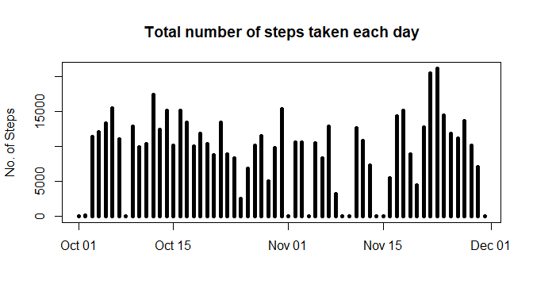
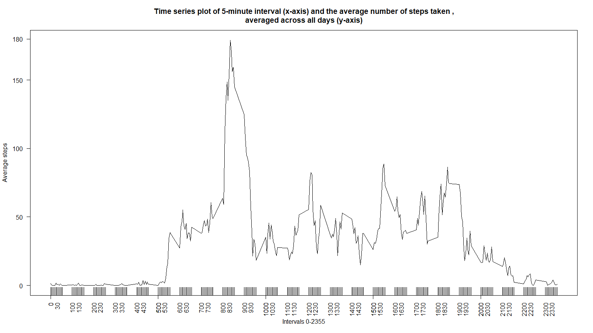
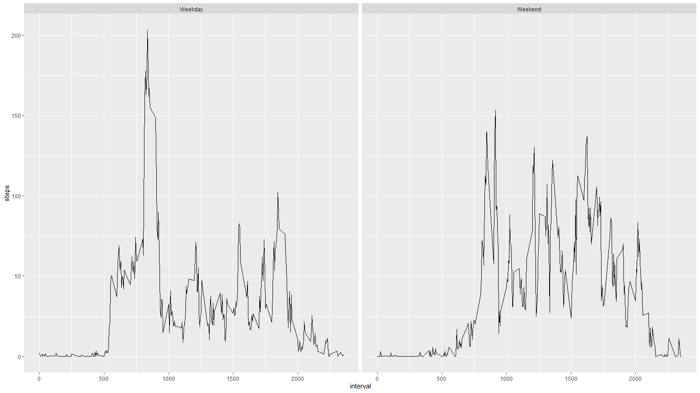

## Loading and preprocessing the data  

A simple and straighforward job. 

Load the data by using the following code:

```r
library(readr)
activity <- read_csv("activity.csv")
head(activity)
```

```
## # A tibble: 6 x 3
##   steps date       interval
##   <dbl> <date>        <dbl>
## 1    NA 2012-10-01        0
## 2    NA 2012-10-01        5
## 3    NA 2012-10-01       10
## 4    NA 2012-10-01       15
## 5    NA 2012-10-01       20
## 6    NA 2012-10-01       25
```

We find that there are quite a few NA sprinkled in the steps. Let us replace them by 0.

```r
activity$steps[is.na(activity$steps)]=0
head(activity)
```

```
## # A tibble: 6 x 3
##   steps date       interval
##   <dbl> <date>        <dbl>
## 1     0 2012-10-01        0
## 2     0 2012-10-01        5
## 3     0 2012-10-01       10
## 4     0 2012-10-01       15
## 5     0 2012-10-01       20
## 6     0 2012-10-01       25
```

## What is mean total number of steps taken per day?

We will need to load few packages before proceeding, there are dplyr and ggplot2.  

First let us try to visualize the data, here we will plot a histogram density plot of the steps of each day.
For this we will have to group the activities by the date, for this we will use the group_by function from dplyr package.


```r
mod1<-group_by(activity,activity$date)
plot_data<-summarise(mod1,steps=sum(steps))
plot(plot_data$`activity$date`,plot_data$steps,type = "h",xlab = "",ylab = "No. of Steps",main="Total number of steps taken each day",lwd=5)
```



From the plot we can see that first half of November has the least activity.

Now let us summarise the data and get the mean and median of the steps taken per day.

```r
summary_data<-summarise(mod1,total_steps=sum(steps[steps>0]),mean_steps=mean(steps[steps>0]),median_steps=median(steps[steps>0]))
head(summary_data,15)
```

```
## # A tibble: 15 x 4
##    `activity$date` total_steps mean_steps median_steps
##    <date>                <dbl>      <dbl>        <dbl>
##  1 2012-10-01                0      NaN           NA  
##  2 2012-10-02              126       63           63  
##  3 2012-10-03            11352      140.          61  
##  4 2012-10-04            12116      121.          56.5
##  5 2012-10-05            13294      155.          66  
##  6 2012-10-06            15420      145.          67  
##  7 2012-10-07            11015      102.          52.5
##  8 2012-10-08                0      NaN           NA  
##  9 2012-10-09            12811      135.          48  
## 10 2012-10-10             9900       95.2         56.5
## 11 2012-10-11            10304      137.          35  
## 12 2012-10-12            17382      157.          46  
## 13 2012-10-13            12426      119.          45.5
## 14 2012-10-14            15098      161.          60.5
## 15 2012-10-15            10139      132.          54
```

We see that for some days the number of steps=0. This could be because of NA data or no activity measured on that day. I have decided to leave it as is and assume that indeed no activities performed/measured by the user on that day.

## What is the average daily activity pattern?

Here we will group the activity data by intervals, i.e 0-2355 minutes on a 5 minute interval basis.

```r
mod2<-group_by(activity,interval)
plot_data2<-summarise(mod2,steps=mean(steps))
with(plot_data2,plot(interval,steps,type="l",las=2,xlab = "Intervals 0-2355",ylab = "Average steps",main="Time series plot of 5-minute interval (x-axis) and the average number of steps taken ,\naveraged across all days (y-axis)"))
rug(plot_data2$interval)
axis(1,at = plot_data2$interval,tick = "FALSE",las=2)
axis(2,at=180,las=2)
```



From the figure we see that on average in the intervals 830 to 930 are the highest number of steps taken on average.  
In particular the interval 835 has the highest steps on average at 180 steps.

## Imputing missing values

There are many NA and zero values in the raw data. I have decided to treat all those values as "No activity/Not measured" and have set their values to 0.(this is shown under loading and preprocessing the data heading)

## Are there differences in activity patterns between weekdays and weekends?

Here we will add a catagorical variable that segregates the data into weekdays and weekends and check for differences in activity patterns when mean steps per intervals is compared.

```r
activity_day<-mutate(activity,day=weekdays(date))
day<-activity_day$day

catagory<-NULL
for (n in 1:length(day)) {
  if (day[n]=="Saturday"|day[n]=="Sunday") {
    catagory[n]="Weekend"
  }else{catagory[n]="Weekday"}
  
}

activity_day<-mutate(activity_day,day_type=catagory)
mod3<-group_by(activity_day,day_type,interval)
plot_data3<-summarise(mod3,steps=mean(steps))

ggplot(data=plot_data3,aes(interval,steps))+geom_line()+facet_wrap(~day_type)
```


Here we find that on average the weekends see higher activity, while some of the highest stepcounts occour on the weekdays.
